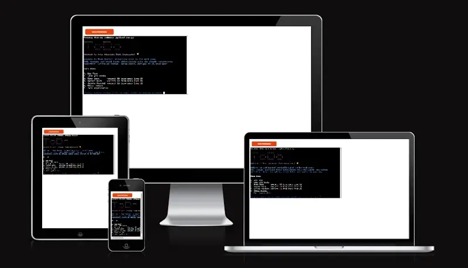

# Task Master

Task Master is a user-friendly to-do list app designed for casual users, students, and professionals to efficiently manage tasks, priorities, and deadlines. It features Google Sheets integration, intuitive task prioritization, a clean interface, and real-time collaboration, making task management straightforward and customizable.

This app solves the problem of managing daily responsibilities in a busy world by providing a digital platform for users to note tasks, assign priority levels, set deadlines, and track progress. It helps users focus on important tasks, manage time effectively, and improve productivity by offering a reliable and organized system for task management. Task Master is accessible to anyone seeking to enhance their daily and long-term productivity, acting as a digital assistant to navigate tasks with ease and clarity.


Visit the deployed application at [Heroku](https://task-maestro-fc8139fbc4e1.herokuapp.com/)

## CONTENT

* [Introduction](#introduction)
  * [Who is the application for](#who-is-the-application-for)
  * [The problem it solves and its intended use](#the-problem-it-solves-and-its-intended-use)
* [Objectives](#objectives)
  * [Developer's goal](#developers-goal)
  * [User's goal](#users-goal)
* [User Experience](#user-experience)
  * [The Strategy](#the-strategy)
  * [The Scope](#the-scope)
  * [The Structure](#the-structure)
  * [The Skeleton](#the-skeleton)
  * [User stories](#user-stories)
* [Design](#design)
  * [Color Usage in Application](#color-usage-in-application)
  * [Accessibility](#accessibility)
  * [Am I Responsive](#am-i-responsive)
* [Features](#features)
  * [Existing features](#existing-features)
  * [Future features](#future-features)
* [Technologies used](#technologies-used)
  * [Language](#language)
  * [Tools](#tools)
* [Data Model](#data-model)
  * [Flowchart](#flowchart)
  * [Functions & Error Handling](#functions--error-handling)
  * [Error Handling Strategy](#error-handling-strategy)
  * [Imports](#imports)
  * [Programming paradigm](#programming-paradigm)
* [Testing and known issues](#testing-and-known-issues)
* [Prerequisites and Deployment](#prerequisites-and-deployment)
  * [Prerequisite](#prerequisite)
  * [Deploying on Heroku](#deploying-on-heroku)
  * [Essential when creating the Heroku app](#Essentials)
  * [Local Deployment](#local-deployment)
  * [How to Clone](#how-to-clone)
  * [Forking](#forking)
* [Credits](#credits)
   * [Content](#content)
   * [Media](#media)
   * [Acknowledgements](#acknowledgements)

## Introduction

### Objectives

#### Developer's goal

1.	*Create a Simple and Intuitive Interface* 
	- Ensure the application is accessible to users of all skill levels, with clear instructions and feedback.

2.	*Implement Core Functionalities*
	- Develop the application with functionalities such as adding tasks, prioritizing them, setting due dates, listing tasks, and marking them as done.

3.	*Ensure Data Persistence*
	- Incorporate Google Sheets for storing and retrieving tasks, providing users with the ability to maintain their task list across sessions and devices.

4.	*Focus on User Experience*
	- Design the application to handle user inputs gracefully, including validating inputs and providing helpful error messages to guide users.

5.	*Learn and Apply New Skills*
	- Use the project as an opportunity to learn more about Python programming, Google Sheets API, and other relevant technologies or programming concepts.


*<span style="color: blue;">[Back to Content](#content)</span>*

#### User's goal

The user's primary goal in using this to-do list application is to have a reliable and convenient tool that helps them manage their daily tasks, improve their productivity, and reduce the stress associated with forgetting tasks or missing deadlines.

1.	*Stay Organized*
	- Keep track of all their tasks in one place, ensuring that nothing important is overlooked.
	
2.	*Prioritize Tasks*
	- Easily identify and focus on high-priority tasks, optimizing their time and efforts on what matters most.

3. *Track Progress* 
	- Mark tasks as completed, providing a sense of accomplishment and a clear view of what has been achieved versus what remains to be done.

4.	*Enjoy a Hassle-Free Experience*
	- Interact with an application that is easy to use, free from technical glitches, and provides helpful feedback as needed.

*<span style="color: blue;">[Back to Content](#content)</span>*

---

## User Experience

### The Strategy
Dive into productivity with Task Master, a to-do list application crafted to streamline task management effortlessly. Designed with a focus on simplicity and efficiency, Task Master aims to help users organize their daily tasks, prioritize what's important, and track their progress towards completion. By integrating seamlessly with Google Sheets, it ensures that your tasks are always accessible and up-to-date, fostering an environment where productivity thrives.

### The Scope
Task Master is more than just a to-do list; it's a comprehensive task management solution that caters to the needs of various users, from students and professionals to anyone looking to enhance their organizational skills. The application offers a full suite of features, including the ability to add tasks, set priorities and due dates, update task statuses, and delete tasks no longer needed. With a single guess approach for task management actions, users are encouraged to think strategically about their task priorities, making it an essential tool for anyone looking to optimize their daily routine.

### The Structure
At its core, Task Master boasts a structured yet intuitive design that guides users through task management with ease. The application operates on a straightforward, menu-driven interface, allowing for quick navigation between adding, viewing, updating, and deleting tasks. Each task is uniquely identified, ensuring that users can easily manage their tasks without confusion. This structured approach ensures that users can focus more on accomplishing their tasks and less on how to manage them.

### The Skeleton
For the thorough planning and organization of Task Master's components and functionalities, tool ['draw.io'](https://www.drawio.com/) were employed to create a detailed visual diagram. This served as a foundational blueprint throughout the development process, guiding the creation of a user-friendly interface that is functional. By visually mapping out the application's design and flow, I ensured that Task Master meets user expectations in terms of usability and performance.

### User stories

#### First Time Visitor Goals

##### User story 1: Understand Purpose

  * As a first-time visitor, I want to easily understand the purpose of the task organizer app so that I can decide if it meets my needs.
  
    * *Achieved by*:  Providing having a clear and concise description welcome message on the app's landing page.

##### User story 2: Intuitive UI

  * As a first-time visitor, I want a straightforward and intuitive user interface so that I can quickly navigate the app and perform basic tasks.
  
    * *Achieved by*:  Having implemented a well-organized menu with clear labels and simple instructions for adding, updating, deleting, and viewing tasks.

#### Returning Visitor Goals

##### User story 2: As a returning visitor

  * As a returning visitor I want to quickly access and review the details of a specific task that you've previously added to the organizer.

    * *Achieved by*: Navigating to the "View Task" option on the main menu and entering the Task ID you want yo review. The app will retrieve and display all the details of the specified task, including its description, priority, due date, status, and creation date.

#### Frequent Visitor Goals

##### User story 3: Efficient updating

  * As a frequent visitor, I want to be able to update existing tasks quickly and efficiently without having to re-enter all the details.

    * *Achieved by*: A streamlined "Update Task" functionality, allowing users to selectively modify task details while receiving confirmation upon successful updates.


*<span style="color: blue;">[Back to Content](#content)</span>*

---

## Design

In the Task Master application, I've employed the Colorama library to infuse a touch of color into the terminal interface, enhancing both the visual appeal and the user experience by differentiating various types of information. 

### Color Usage in Application

By thoughtfully integrating these colors into the terminal-based Task Master application, I aim to create a more engaging and intuitive user experience, despite the inherent design limitations of terminal interfaces.


#### Magenta

This vibrant hue welcomes users right from the start, used prominently for the application's ASCII art logo and the welcome message. It's designed to grab attention and set a positive, inviting tone for the user interaction.

#### Blue

I've chosen a calming shade of blue to highlight all user input prompts and messages. This color choice helps to distinguish input fields from the rest of the text, guiding users through their task management journey with clarity.

#### Green

Signifying success, green is used to confirm successful actions within the application, such as the addition of a new task or successful updates to existing tasks. It offers instant, positive feedback that reassures users their actions have been successfully completed.

#### Yellow

This color is reserved for warnings or important notices that require the user's attention. Yellow text might indicate a reminder or a caution before performing actions like task deletion, ensuring users proceed with full awareness of the implications.

#### Red

Employed for error messages or alerts, red is utilized to immediately draw the user's attention to issues or errors, such as invalid inputs or failed operations. This stark contrast against the other colors ensures that errors are not overlooked and can be addressed promptly.

#### White

White, is crucial for general text and information, providing a clear, readable contrast against other colors. It serves as the foundation for the application's visual design, balancing the vibrant colors and maintaining readability and a clean aesthetic.

*<span style="color: blue;">[Back to Content](#content)</span>*

### Accessibility

As of the current version, the Task Master application has not been comprehensively evaluated for accessibility features, including screen reader compatibility, color contrast, and keyboard navigation, which are crucial for users with disabilities. I recognize the importance of making the application accessible to all users and are committed to improving these aspects in future updates.

### Am I Responsive 

A Command Line Interface app isn't inherently aimed at responsiveness in the context of varying screen sizes and interactive web design because it is primarily designed for interaction through a terminal or command prompt, not a graphical user interface or web browsers. The teaser image from "Am I Responsive" highlight this contrast by showing the app's interface in various device frames, illustrating that a CLI app's user experience and layout do not adapt like a web application designed with responsive web design principles.



---
## Features

These features are designed to make the to-do list application a comprehensive tool for managing tasks efficiently, catering to the needs of a wide range of users looking for a simple yet effective way to organize their daily responsibilities. The to-do list application comes packed with several user-friendly features designed to enhance task management and productivity.

### Existing features

Here's an overview of its key features:

**Centralized Task Management**

Effortlessly add, edit, and organize tasks in a centralized Google Worksheet, ensuring your to-do list is always up-to-date and accessible. 


**Dynamic Task Addition and Editing**

Easily add new tasks or modify existing ones, including details such as task descriptions, priorities, and due dates, for precise task management. 


**Unique Task ID Generation**

I implemented the `generate_task_id` function to ensure each task is uniquely identifiable. This choice simplifies the management process for updates, views, or deletions, avoids complex ID generation schemes, and integrates seamlessly with the Google Sheets framework. 


**Prioritization and Deadlines**

Assign priority levels and set due dates for each task, enabling you to manage your workload effectively and focus on what matters most. 


**Efficient Task Listing**

View all tasks at a glance or filter them by priority or due date, providing a clear overview of your responsibilities and helping you plan your day or week with ease. Below a few examples:

**List all tasks in default order by low to high Task ID**


**Sort Priority (High-Med-Low)**


**Sort Due Date (latest to earliest)**


**Task Completion Tracking**

Mark tasks as done, offering a satisfying way to track your progress and maintain motivation. 

**Task prior update of status**


**Task being updated**


**Task updated**

 

**Error Handling and User Feedback**

Benefit from built-in error handling and user feedback mechanisms, ensuring a smooth and intuitive user experience even when mistakes are made. 

**Error managment when adding a task**

These are common error types managed during the task addition process.
* Validation Errors, occur when user input does not meet predefined criteria, such as due dates in the past or incorrect formats for input fields. These errors prompt the user to re-enter data correctly.
* Empty Input Errors are triggered when the user submits an empty string for a required field. The application alerts the user that input is necessary to proceed.
* API Errors are also handled but now shown in image, Example on an API error is when there's an issue communicating with external services, like Google Sheets. Users are  informed that the operation couldn't be completed and are asked to try again later.


**Error managment udating a task**

These are common error types managed during the task updating process.


#### Flexible Access and Data Persistence

With tasks stored in Google Sheets, access your task list from any device, ensuring that your data is always there when you need it. Security and privacy are paramount, and I've taken measures to ensure data security, including the use of secure API keys and restricted spreadsheet access. 


#### Secure and Easy Exit

Confidently exit the application, knowing that all your tasks are safely stored in Google Sheets, ready for your next session. 


*<span style="color: blue;">[Back to Content](#content)</span>*

### Future Features

There are a lot one can do to enhance this application, I want to highlight these four (in no specific prioirity order). These features stand out because they address critical aspects of task management and personal productivity—integration with existing tools, collaboration, ease of use, and actionable insights. Implementing these would significantly enhance the application's value, making it a more versatile and indispensable tool for users.

#### Integration with Calendar Applications

- **Description**: Allow users to sync their to-do list items with their preferred calendar applications (e.g., Google Calendar, Microsoft Outlook).
- **Benefit**: Users can see their tasks alongside their appointments, providing a comprehensive view of their schedules.

#### Collaborative Task Management

- **Description**: Add features that enable users to share lists with others, assign tasks, and track progress collaboratively.
- **Benefit**: Facilitates teamwork and shared task management, making the app suitable for both personal and professional use.

#### Natural Language Processing (NLP) for Task Entry

- **Description**: Utilize NLP to allow users to add tasks in natural language, which the app can then parse into structured task entries.
- **Benefit**: Simplifies the process of adding new tasks, making the application more intuitive and user-friendly.

#### Analytics and Productivity Insights

- **Description**: Offer analytics features that give users insights into their task completion patterns, productivity trends, and suggest optimizations.
- **Benefit**: Helps users understand their productivity habits and make informed adjustments to improve efficiency.

#### Refactoring code to Obejct-Oriented Programming
- **Description**:  Refactor the existing procedural codebase to utilize OOP principles, such as encapsulating related data and behaviors into objects and classes. This involves identifying logical components within the application and organizing them into classes, with methods for handling operations and properties for storing data.
- **Benefit**:  By refactoring to OOP, the application's structure becomes more modular, maintainable, and scalable. It allows for easier extension and modification of the codebase, as changes to one part of the system are less likely to affect others. It could also lead to more readable and organized code, improving the overall quality of the application.


*<span style="color: blue;">[Back to Content](#content)</span>*

---

## Technologies Used

### Language

[Python](https://www.python.org) used as the back-end programming language.

### Tools

* [Code Institute Python Linter](https://pep8ci.herokuapp.com/): A tool to check Python code against some of the style conventions in [PEP8](https://peps.python.org/pep-0008/).
* [Draw.io](https://www.drawio.com/): Useful for planning the application's architecture and flowcharts, especially helpful in the design phase to visualize the application flow.
* [Git](https://git-scm.com) used for version control. (```git add```, ```git commit```, ```git push```)
* [Visual Studio Code](https://code.visualstudio.com/): A versatile and powerful IDE that supports Python development well, offering debugging tools, extensions for Python, and integrated Git control. While Gitpod provides its own web-based VS Code editor, one might use the desktop version for local development or when offline.
* [Gitpod](https://gitpod.io) Streamlines your development process by providing a pre-configured, cloud-based development environment that's instantly ready for coding.
* [GitHub](https://github.com) Essential for version control, allowing you to track changes, collaborate with others (if applicable), and for secure online code storage.
* [Heroku](https://www.heroku.com): A platform for deploying and hosting web applications. 
* [Markup Validation Service](https://validator.w3.org/) - Used to check code ensuring that my HTML is error-free and adheres to the latest web standards.
* [PEP8](https://peps.python.org/pep-0008/): Style Guide for Python Code.


*<span style="color: blue;">[Back to Content](#content)</span>*

---

## Data model

### Flowchart

To follow best practice, a flowchart was created for the app's logic, and mapped out before coding began using a free version of [Draw.io](https://www.drawio.com/).


### Functions & Error Handling

The primary functions used in this application are designed to streamline the task management process, making it intuitive and efficient for users to interact with their tasks. 

The application is built with a focus on procedural programming, leveraging a series of functions to handle the core logic and interactions with the Google Sheets API. 
While incorporating robust error handling to ensure a smooth and reliable user experience.

Below is an outline of some key functions within the application and the specific roles they play:

#### `generate_task_id()`

This function assigns a unique identifier to each task, crucial for the easy management, updating, viewing, or deletion of tasks. It ensures tasks can be uniquely and efficiently managed within the system.

#### `get_user_input()`

At the core of user interaction, this function captures and validates user input, supporting various input types. It incorporates validation logic to maintain data integrity and provides user-friendly feedback, crucial for guiding users through correct data entry.

#### `get_valid_due_date()`

Validates that due dates for tasks are set in the future, a critical component for effective task scheduling and prioritization. This function helps users plan and prioritize their tasks with logical and practical due dates.

#### `add_row_to_sheet()`

Handles the addition of new tasks to the Google Sheet, encapsulating both the creation logic and error handling for API limits and connectivity issues. This ensures tasks are reliably stored in the application's persistent storage.

#### `list_all_tasks()`

Retrieves and displays all tasks from the Google Sheet, allowing users to view their entire task list in a structured format. Integrated error handling addresses unexpected data formats or API changes, ensuring robustness.

#### `view_task()`

Provides the functionality for detailed viewing of specific tasks based on their unique task ID. Error handling is integrated to offer clear feedback if a task ID does not correspond to an existing task, enhancing user interaction.

#### `update_task()`

Enables modifications to existing tasks, including updates to task descriptions, priorities, due dates, and statuses. The function includes error handling strategies to manage invalid inputs or issues when updating the Google Sheet.

#### `delete_tasks()`

Facilitates the deletion of tasks from the Google Sheet, with comprehensive error handling to manage invalid task IDs or connectivity problems, enabling users to efficiently remove completed or outdated tasks.


The design and implementation of these functions are geared towards simplifying task management, ensuring that users can easily add, view, update, and delete tasks. By leveraging Google Sheets as a backend, the application also offers real-time data persistence and accessibility from any device.

### Error Handling Strategy

Error handling in the application is not confined to a single function but is woven throughout the application's logic. This approach ensures that users are provided with clear, actionable feedback in case of input errors, connectivity issues, or API limitations. Whether it's a validation error for a due date or an API limit being reached, the application strives to inform users of the issue and guide them towards resolving it. This not only enhances the user experience but also contributes to the application's overall reliability and robustness.

By integrating error handling directly into the core functions and operations, the application can gracefully manage exceptions, maintain consistent performance, and ensure data integrity. This careful consideration of error handling is a testament to the application's design philosophy, prioritizing user satisfaction and operational reliability.


*<span style="color: blue;">[Back to Content](#content)</span>*

### Imports

Following Python packages and/or external imported packages was used:

* [os](https://www.geeksforgeeks.org/os-module-python-examples/?ref=lbp) - The OS module in Python provides functions for interacting with the operating system.
* [datetime](https://www.geeksforgeeks.org/python-datetime-module/#python-datetime-module) - Basic date and time type. Python Datetime module comes built into Python, so there is no need to install it externally. 
* [gspread](https://pypi.org/project/gspread/) - Google Spreadsheets Python API
* [PrettyTable](https://pypi.org/project/prettytable/) -  A simple Python library for easily displaying tabular data in a visually appealing ASCII table format
* [textwrap](https//:docs.python.org/3/library/textwrap.html) - Text wrapping and filling

To install use : ```pip install -name of package-```
To generate list of installed Python packages use:  ```pip freeze```


*<span style="color: blue;">[Back to Content](#content)</span>*

### Programming paradigm

Procedural Programming and Object-Oriented Programming (OOP) represent two separate methodologies for coding, each with its unique approach to code organization and structure. For my project, which is a straightforward small to medium sized project - a task manager (To-Do-list) application. I opted for the procedural programming method. This method emphasizes the creation of functions or procedures that manipulate data, making it suitable for a basic application. Additionally, at this stage in my education, I find procedural programming easier to grasp, as it employs a more linear method of programming.


*<span style="color: blue;">[Back to Content](#content)</span>*

---

## Testing

### Results and known issues
Please refer to [TESTING.md](/TESTING.md) file for all testing and trouble shooting carried out.

*<span style="color: blue;">[Back to Content](#content)</span>*

---

## Prerequisites and Deployment  

The game was developed in VS Code, stored in GitHub as the local repository, and deployed on Heroku.

### Prerequisite

* Ensure [Python](https://www.python.org/) is installed on your system.
* Verify that Python is installed on your system by checking its version. This can be done through a command in the terminal or by running a small piece of Python code that outputs the version information.
* For installing libraries and modules, use pip or pip3 depending on your Python version

### Deploying on Heroku

1. **Heroku Account:**
   - Make sure you have a Heroku account. If not, sign up on the Heroku website.
   
2. **GitHub Repository:**
   - Ensure your project is hosted on GitHub.
   
3. **Heroku Dashboard:**
   - Log in to your Heroku account and go to the Heroku Dashboard.
   
4. **Create a New App:**
   - On the dashboard, click `New` and choose `Create new app`.
   
5. **App Name:**
   - Choose a unique name for your app.
   
6. **Region & Create App:**
   - Choose a region closest to you (EU or USA), then Select **Create App**
   
7. **New App**
   - From the new app **Settings**, click **Reveal Config Vars**, and set the value of KEY to `PORT`, and the value to `8000` then select *add*.   
   
8. **Cofidential credentials**
   - If one need to use any private credentials, like CREDS.JSON, you should also add them to the Config Variables section. This is a crucial step for maintaining the security and integrity of your application, especially when it interacts with external services or APIs that require authentication. 
   
9. **Add Buildpack**
   - Scroll further down on page, to support dependencies, select **Add Buildpack**.
   - It's crucial to arrange the buildpacks correctly! First choose Python and then Node.js. If they're not in this sequence, you can reorder them by dragging.
   
10. **Extra files for Heroku deployment**
   - For successful deployment, Heroku requires two extra files:
      - requirements.txt
	  - Procfile
	  
	  Purpose: It specifies the dependencies to be installed for your application to function correctly.
	  Impact on Deployment: Heroku reads this file to understand which packages and versions to install in the deployment environment.Ensures consistency between local and deployed environments, reducing deployment failures and runtime errors.
	  
11. **requirements**
   - To install the necessary requirements for this project (where applicable), use the following command:
     ```pip3 install -r requirements.txt```
	 
12. **Own packages**
   - If you've installed your own packages, you need to update the requirements file with:
     ```pip3 freeze --local > requirements.txt```
	 
13. **Procfile**
   - To create the Procfile, use the command below:
     ```echo web: node index.js > Procfile```
	 
14. **Heroku deployment method**
   - Following these steps to connect your frontend terminal and deploy your application to Heroku!  
   a. Connect to Heroku:
      Open your Terminal/CLI and log in to Heroku with: ```heroku login -i```
	  
   b. Set Heroku Remote:
      Configure the Heroku remote using: ```heroku git:remote -a app_name``` (substitute app_name with the name of your app)
	  
   c. Git Operations:
      Execute the usual Git commands: ```add```, ```commit```, and ```push``` to update your repository on GitHub.
	  
   d. Deploy to Heroku:
      To deploy, enter: ```git push heroku main``` in the terminal.
	  
   - Alternatively:
     You can opt for Automatic Deployment directly from the Heroku app interface.


*<span style="color: blue;">[Back to Content](#content)</span>*   

### Local Deployment

The project can be cloned or forked in order to make a local copy on your own system.

For either method, you will need to install any applicable packages found within the *requirements.txt* file.
- ```pip3 install -r requirements.txt```.

If using any confidential credentials, such as `CREDS.json` or `env.py` data, you'll have to manually incorporate these into your new project as well.


*<span style="color: blue;">[Back to Content](#content)</span>*

### How to Clone

To clone the project repository:

1. Log in (or sign up) to GitHub.
2. Go to the repository for this project, [JaqiKal/task-master](https://github.com/JaqiKal/task-master)
3. Click on the code button, select whether you would like to clone with HTTPS, SSH or GitHub CLI and copy the link shown.
4. Open Git Bash or Terminal
5. Change the current working directory to the location you want to use for the cloned directory.
6. In your IDE Terminal, type the following command to clone my repository:
	- `git clone https://github.com/JaqiKal/task-master`
7. Press Enter to create your local clone.


*<span style="color: blue;">[Back to Content](#content)</span>*

### Forking

Forking the GitHub Repository allows us to create a duplicate of the original repository in our own GitHub account. This enables us to explore and modify the content without impacting the original repository. To fork this repository, follow these steps:

1. Log in to GitHub and locate the [GitHub Repository](https://github.com/JaqiKal/task-master)
2. At the top of the Repository (not top of page) just above the "Settings" Button on the menu, locate the "Fork" Button.
3. Once clicked, you should now have a copy of the original repository in your own GitHub account!


*<span style="color: blue;">[Back to Content](#content)</span>*

### Local VS Deployment

At the time of writing, there is no differance between the local version and the version deployed on Heroku.


*<span style="color: blue;">[Back to Content](#content)</span>*

---

## Credits

### Content

This application was made possible by leveraging insights and code examples from a range of external resources. Below is a list of these key sources, which have significantly contributed to the functionality and design of the application. A heartfelt thank you to the creators and maintainers of these resources for their invaluable assistance.

* [os](https://www.geeksforgeeks.org/os-module-python-examples/?ref=lbp) - The os module in Python provides a way to interface with the underlying operating system, allowing you to perform tasks like navigating the file system, managing files, and executing system commands, enhancing portability and interaction with the host environment.
* [gspread](https://docs.gspread.org/en/v6.0.0/) - Amended from Code Institute project love_sandwiches
* [import datetime](https://www.geeksforgeeks.org/python-datetime-module/) - For handling date and time operations.
* [prettytable](https://pypi.org/project/prettytable/) - Used for organizing tabular data.
* [API error handling](https://docs.gspread.org/en/latest/api/exceptions.html) - For managing API interactions.
* [API error handling](https://snyk.io/advisor/python/gspread/functions/gspread.exceptions.APIError) - For managing API interactions.
* [class ExitToMainMenu(Exception)](https://stackoverflow.com/questions/1319615/proper-way-to-declare-custom-exceptions-in-modern-python) -  Inspired custom error handling in the application.
* [format the time stamp which is in string format to date-time object](https://geeksforgeeks.org/python-datetime-strptime-function/) For parsing and converting date strings.
* [Try - Except](https://www.w3schools.com/python/python_try_except.asp) - For robust error management.
* [Print Colors in Python Terminal ](https://www.geeksforgeeks.org/print-colors-python-terminal/) - For enhancing terminal output aesthetics.
* [Sorting](https://ioflood.com/blog/python-sort-dictionary-by-value/#:~:text=TL%3BDR%3A%20How%20Do%20I,items()%2C%20key%3Doperator.) - Essential for data organization.
* [Sorting](https://pythonhow.com/how/sort-a-list-of-dictionaries-by-a-value-of-the-dictionary/) - Essential for data organization.
* [Sorting](https://www.geeksforgeeks.org/ways-sort-list-dictionaries-values-python-using-lambda-function/) - Essential for data organization.

*<span style="color: blue;">[Back to Content](#content)</span>*

### Media

For this project no external media was used for creation of this project.

*<span style="color: blue;">[Back to Content](#content)</span>*

### Acknowledgements 

I would like to thank! 

* My mentor [Jubril Akolade](https://github.com/jubrillionaire/) for his help and advice throughout the project.
* The whole team at [Code Institute Slack community](https://code-institute-room.slack.com) for their teaching and support.
* To all engaged fellow student at all channels and a special shout out to slack channel [community sweden](https://app.slack.com/client/T0L30B202/C03J2BCURV3).
* My immediate and extended family, as well as my friends, support and cheer me on!


*<span style="color: blue;">[Back to Content](#content)</span>*